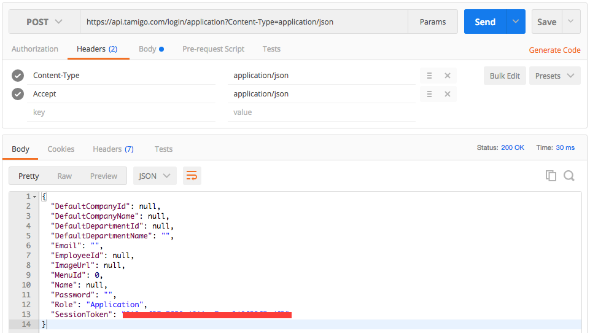
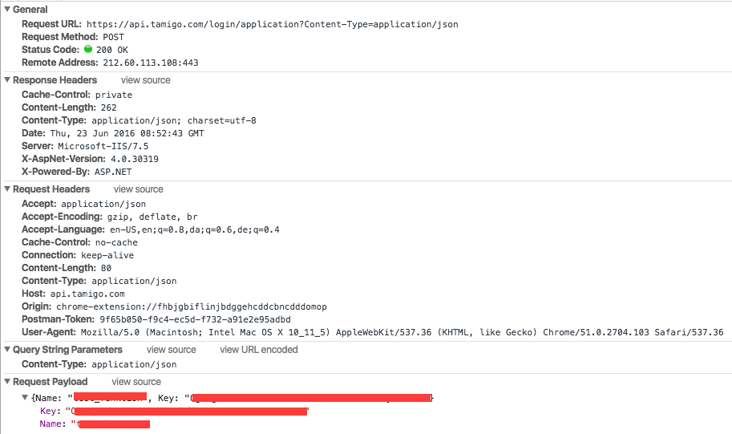

.. _examples:

API Examples
============

.. danger:: This is not `official <http://www.tamigo.dk/andet/api-dokumentation/>`_ documentation, but community driven work in progress for offering better api documentation.

Introduction
------------
To test a REST api at least two things are needed. A general understanding of HTTP/REST and a tool for sending requests. Here are some good resources for getting started with HTTP and REST: 

Background

* The Wiki entry on `http <https://en.wikipedia.org/wiki/Hypertext_Transfer_Protocol>`_
* The Wiki entry on `REST <https://https://en.wikipedia.org/wiki/Representational_state_transfer>`_
* This video on `REST API concepts and examples <https://www.youtube.com/watch?v=7YcW25PHnAA>`_

Read more about curl and installation `here <http://www.ethanmick.com/getting-started-with-curl/>`_.

Tools
*****

There are many tools available to test an API, consider the following: 

* `postman <http://www.getpostman.com/>`_ one of the most widely used API tools and extremely user friendly
* `curl <https://curl.haxx.se/>`_ an extreme popular open source commandline tool
* `requests <http://docs.python-requests.org/en/master/>`_ is an extremley popular python library for api scripting

The following examples will show how to work the API with the different tools, to help you get a feeling of how to use the API. Before using the tamigo API, read this `section <http://tamigo-docs.readthedocs.io/en/latest/api.html#login-service>`_ of how to obtain a key. 

Application Login Postman
-------------------------
It is important to enable Chrome Developer Tools insede Postman, follow this `guide <http://blog.getpostman.com/2014/01/27/enabling-chrome-developer-tools-inside-postman/>`_. This lets you inspect the raw request.

**Configure the request**

* Change from GET to POST request with the following url https://api.tamigo.com/login/application?Content-Type=application/json
* Set the header "Content-Type" to application/json
* Set the header "Accept" to applicaiton/json
* Set the body, raw to your name and key as listed when you log in to tamigo.com: {"Name": "micros", "Key": "longstringasyourpasscodegeneratedfromtheapplication"}

When you have made the settings hit the send button, and you should see the following:

**Inspect the request**

If something does not behave as expected, you can use the Chrome Developer Tools to inspect the network package, and see the underlying header. Notice for example the additional default headers Postman added to the request. 

